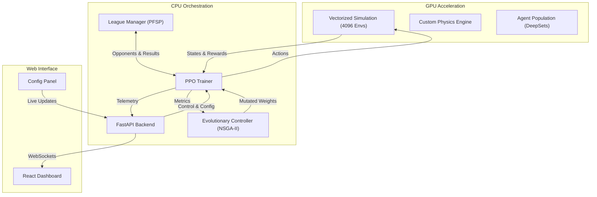

# Sebulba's Legacy (Pod Racer AI)


*Real-time training dashboard visualizing 4096 concurrent agents and population metrics.*

## 🏎️ Project Overview

**Sebulba's Legacy** is an advanced Reinforcement Learning (RL) system designed to train super-human autonomous racers for the *Mad Pod Racing* environment. This project replaces the original Sebulba pod trainer, introducing a fully **vectorized environment**, enhanced **model infrastructure**, and refined **Genetic Algorithm** techniques. 

Unlike traditional RL implementations that run a handful of environments, this project leverages a custom **GPU-Accelerated Physics Engine** to simulate **4096 environments in parallel** on a single consumer GPU (achieving **>20,000 Steps Per Second** on an RTX 5070). This massive throughput allows for the training of robust agents using **Population-Based Training (PBT)** within hours rather than days.

The system combines state-of-the-art techniques from Deep Learning and Evolutionary Algorithms to solve complex continuous control problems.

## 🚀 Key Features

### 🧠 Advanced Reinforcement Learning
*   **Massive Parallelism**: Trains on **4096 concurrent environments** using pure PyTorch operations (Sim-to-Tensor), bypassing CPU bottlenecks.
*   **PPO + GAE**: Utilizes Proximal Policy Optimization with Generalized Advantage Estimation for stable and sample-efficient learning.
*   **Split DeepSets Architecture**:  
    *   **Teammate Awareness**: Explicitly feeds teammate observations (Position, Velocity, Shield) directly to the backbone, enabling precise cooperative strategies (e.g., blocking, drafting).
    *   **Heterogeneous Dual-Brain**: We deploy two specialized networks within the same agent:
        *   **Runner Brain** (Hidden 128): Optimized for racing lines and speed.
        *   **Blocker Brain** (Hidden 128): Optimized for interception and disruption.
        *   This setup fits within the 100k char export limit (~68k chars) while allowing role specialization.
    *   **Enemy Permutation Invariance**: Processes enemy observations via a **DeepSets Encoders** to handle varying numbers of opponents (Solo, Duel, League) without architecture changes.
    *   **Observation Space**: Flattened structure: `[Self Params, Teammate Params, Enemy Context (DeepSets), Checkpoint Vector]`.
*   **Intrinsic Curiosity (RND)**: Incorporates **Random Network Distillation** to encourage exploration in sparse reward scenarios, preventing premature convergence.
*   **Role Regularization**: implements a custom **Diversity Loss** (KL Divergence) between the Runner and Blocker heads during the Team stage. This forces the two efficient policy heads to specialize and behave differently in identical situations, preventing mode collapse.
*   **Prioritized Fictitious Self-Play (PFSP)**: The system maintains a "League" of historical checkpoints. Using a **Payoff Matrix**, it prioritizes opponents with whom the current agent has a ~50% win rate (High Regret), maximizing the learning signal.
*   **Implicit Exploiters**: 
    *   **Implicit League Exploiter**: Standard PFSP agents that prey on the weaknesses of the entire history.
    *   **Implicit Main Exploiter**: A 10% chance to sample opponents from the **latest generation**, forcing the population to remain robust against the current meta.

### 🧬 Evolutionary Strategy (GA + RL)
*   **Population-Based Training (PBT)**: Evolves a population of 32 distinct agents. Agents don't just learn a policy; they evolve their hyperparameters (**Learning Rate**, **Entropy Coefficient**, **Clip Range**) and reward weights over time. This allows the population to dynamically adjust its "conservativeness" and exploration vs exploitation balance.
*   **NSGA-II Selection**: Uses **Non-Dominated Sorting Genetic Algorithm II** to select elite agents based on multiple conflicting objectives that change per stage:
    *   **Stage 0 (Solo)**: Minimize Steps (Efficiency) + Maximize Checkpoint Streak (Consistency).
    *   **Stage 1 (Duel)**: Maximize Win Streak + Minimize Steps.
    *   **Stage 2 (Team)**: Maximize Win Rate + Minimize Steps (2v2 Cooperative).
    *   **Stage 3 (League)**: Maximize Win Rate + Maximize Laps Completed + Minimize Steps.
    *   **All Stages**: Maximize **Behavioral Novelty** (using EMA of speed/steering vectors) to maintain diversity.
*   **Dynamic Reward Shaping**: The system "discovers" the optimal reward function by mutating the weights of various signals (Velocity, Orientation, Winning) during evolution.

### 📈 Curriculum Learning
The training process is automated through distinct stages of difficulty:
1.  **Stage 0: Solo Time Trial**: Agents maximize speed and control to navigate checkpoints (Goal: >50k Laps).
2.  **Stage 1: Duel (1v1)**: Agents face a scripted bot with **Dynamic Difficulty Scaling**.
    *   **Progression Mechanism**:
        *   **Standard**: Difficulty increases (+0.05) if Win Rate > **70%**.
        *   **Turbo**: Difficulty increases (+0.10) if Win Rate > **90%**.
        *   **Super Turbo**: Difficulty jumps (+0.20) if Win Rate > **98%**.
    *   **Regression Mechanism**:
        *   **Immediate**: Difficulty drops (-0.05) if Win Rate falls below **30%**.
        *   **Persistent**: Difficulty drops if Win Rate stays below **40%** for 2 consecutive checks (2000 games).
3.  **Stage 2: Team (2v2)**: Agents control two pods (Runner & Blocker) against a scripted 2v2 team. 
    *   **Mitosis Transition**: Upon entering Stage 2, the **Runner's weights are cloned to the Blocker**. This ensures the team starts with two competent drivers, preventing the "Dead Weight Blocker" problem. The Blocker then evolves independently towards aggression.
    *   **Reward Decoupling**: Rewards are initially calculated per-pod (Individual) to help agents learn basic control in the new environment.
    *   **Team Spirit**: A blending factor (`0.0` to `0.5`) linearly blends the reward signal from "Selfish" (My Velocity/Checkpoints) to "Cooperative" (Team Average) as difficulty increases.
    *   **Adaptive Evolution**: The evolution interval scales dynamically with difficulty (every 16 iterations at Diff 0.0 → every 4 iterations at Diff 1.0) to ensure robust selection during the initial high-variance phase.
4.  **Stage 3: League**: Agents compete against a persistent "League" of historical elite agents in full 4-pod races.

### 📊 Real-Time Visualization
*   **Web Dashboard**: A React + Konva frontend rendering the simulation at 60 FPS.

### 🧬 Evolutionary Strategy (NSGA-II)
We use a **Multi-Objective Genetic Algorithm** to select the best agents for the next generation.
*   **Stage 0 (Solo)**: `[Consistency, -Efficiency, Novelty]`
*   **Stage 1 (Duel)**: `[Win Rate, -Efficiency, Novelty]`
*   **Stage 2 (Team)**: **Role-Specific Selection**
    *   **Win Rate**: Primary objective.
    *   **Runner Velocity**: Maximize average velocity of the Runner pod.
    *   **Blocker Damage**: Maximize impact damage dealt by the Blocker pod.
*   **Stage 3 (League)**: `[Win Rate, Laps, -Efficiency]`

### 📊 Real-Time Visualization
*   **Web Dashboard**: A React + Konva frontend rendering the simulation at 60 FPS.
*   **Telemetry**: Displays real-time metrics for Learning Rate, Entropy, Win Rate, and detailed Population Stats.
*   **Interactive Control**: Allows users to manually halt training, export submissions, or "Wipe/Reset" checkpoints dynamically.

## 🛠️ Architecture



## 📦 Installation

### Prerequisites
*   **OS**: Linux (Recommended) or Windows (WSL2)
*   **Python**: 3.12+
*   **Node.js**: 20+
*   **GPU**: NVIDIA GPU with CUDA support (Required for simulation)
    > [!WARNING]
    > **Strict GPU Requirement**: This project relies on a custom GPU-based physics engine (`gpu_physics.py`) for massive parallelism. There is **NO CPU fallback**. Attempting to run this on a CPU-only machine will fail.

### Setup

1.  **Clone the Repository**
    ```bash
    git clone https://github.com/Vietnoirien/Sebulba-s-Legacy.git
    cd sebulbas-legacy
    ```

2.  **Install Python Dependencies**

    > [!IMPORTANT]
    > To compute with Torch on an NVIDIA GPU, it must be installed from [pytorch.org](https://pytorch.org/get-started/locally/) first.

    ```bash
    python -m venv .venv
    source .venv/bin/activate  # or .venv\Scripts\activate.ps1 on Windows

    # Example: Install PyTorch with CUDA support (Visit website for your specific command)
    # pip3 install torch --index-url https://download.pytorch.org/whl/cu118

    pip install -r requirements.txt
    pip install aiohttp # For telemetry
    ```

3.  **Install Frontend Dependencies**
    ```bash
    cd web/frontend
    npm install
    cd ../..
    ```

## 🎮 Usage

The project includes a unified launcher to start the Training Loop, Backend API, and Frontend simultaneously.

**Start the System:**
```bash
python launcher.py
```

*   **Dashboard**: Open `http://localhost:5173`
*   **API**: `http://localhost:8000`

### Dashboard Interface (Web UI)

**1. Operations Panel**
*   **Status Indicator**: Visual feedback for the currently active model.
*   **Start With...**: Options to start from scratch, resume a full **Generation**, or load a specific **Best Agent** (Checkpoint).
*   **Progression Mode**:
    *   **AUTO**: Automatically advances stages based on graduation thresholds.
    *   **MANUAL**: Force a specific stage (Solo, Duel, Team, League).
*   **Stage Selector**: Manually override the current curriculum stage (Available in Manual mode).

**2. Control Buttons**
*   **INIT SEQUENCE**: Starts or resumes the training loop with selected settings.
*   **HALT**: Safely pauses the training loop (waits for current step to finish).
*   **RESET**: Resets the environment state (positions/velocities) without clearing the model.
*   **SNAPSHOT**: Manually saves a checkpoint of the current leader.
*   **EXPORT SUBMISSION**: Generates a `submission.py` for Codingame.
*   **WIPE ALL CHECKPOINTS**: ⚠️ Destructive action. Deletes all saved models and generations to start fresh.

**3. Config Panel (Live Tuning)**
The new configuration interface allows for **Live Tuning** of the training session without restarting, organized by tabs:

*   **General**: 
    *   **Curriculum**: Manually adjust Curriculum Stage and Bot Difficulty (0.0 - 1.0).
    *   **Training**: Real-time tuning of Hyperparameters (Learning Rate, Entropy Coefficient).
*   **Objectives**:
    *   **Strategic**: Adjust Dense Factor (Tau) and **Team Spirit** (Blend factor: 0.0=Individual Rewards, 1.0=Team Average).
    *   **Outcome**: Configure weights for Win, Loss, Checkpoint, and Checkpoint Streak Scale.
*   **Physics**: 
    *   **Movement**: Tune Velocity (Dot Product) and Step Penalty weights.
    *   **Alignment**: Adjust Orientation reward and Wrong Way penalty.
*   **Combat**: 
    *   **Collisions**: Tune rewards for hitting the Blocker, and penalties for Runner/Teammate collisions.
*   **Transitions**: 
    *   **Thresholds**: Fine-tune the specific criteria required to graduate between stages (Efficiency, Consistency WR, Absolute WR).
*   **Presets**: 
    *   **Management**: Save and Load your custom training configurations for quick setup.
*   **Actions**:
    *   **APPLY LIVE**: Inject the new settings into the actively running training process significantly faster than restarting.
    *   **LAUNCH CUSTOM**: Start a fresh training session using the current panel settings.

**4. Monitoring**
*   **Stats Panel**: Real-time visualization of Win Rate history.
*   **League Panel**: System log console showing initialization events and status updates.

### Headless / CLI Usage
You can run the components individually without the Launcher/UI:

**1. Training Loop (`ppo.py`)**
Run the training logic directly. Useful for debugging or server environments.
```bash
python -m training.ppo
```

**2. Export Submission (`export.py`)**
Convert a trained model checkpoint into a standalone `submission.py` for Codingame.
```bash
python export.py --model data/generations/gen_X/agent_Y.pt --out submission.py
```

## ⚙️ Configuration

Key configurations can be found in `config.py` and `simulation/env.py`.

*   **Map Size**: 16000 x 9000
*   **Physics**: Large Pod Radius (400), High Friction (0.85).
*   **Reward Function**: 
    *   Velocity uses a **Dot Product Projection** ($$\vec{v} \cdot \hat{d}$$) where we reward the component of velocity that is aligned with the direction to the next checkpoint. This explicitly encourages moving *towards* the objective while ignoring perpendicular movement.
    *   Orientation uses a cosine alignment metric with specific penalties for driving the wrong way.
    
## 🏆 Credits

*   **Original Game**: Based on the [Mad Pod Racing](https://www.codingame.com/multiplayer/bot-programming/mad-pod-racing) challenge on Codingame.
*   **Assets**: Original Pod Sprites courtesy of [Codingame](https://www.codingame.com/multiplayer/bot-programming/mad-pod-racing).
*   **Inspiration**: DeepMind's AlphaStar (League Training) and OpenAI's PPO (Proximal Policy Optimization).

---
*Built with ❤️ by Vietnoirien*
