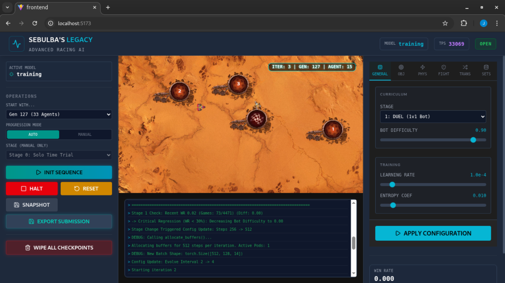

# Sebulba's Legacy (Pod Racer AI)


*Real-time training dashboard visualizing 4096 concurrent agents and population metrics.*

## 🏎️ Project Overview

**Sebulba's Legacy** is an advanced Reinforcement Learning (RL) system designed to train super-human autonomous racers for the *Mad Pod Racing* environment. This project replaces the original Sebulba pod trainer, introducing a fully **vectorized environment**, enhanced **model infrastructure**, and refined **Genetic Algorithm** techniques. 

Unlike traditional RL implementations that run a handful of environments, this project leverages a custom **GPU-Accelerated Physics Engine** to simulate **8,192 environments in parallel** on a single consumer GPU (achieving **~66,000 Steps Per Second** on an RTX 5070). This massive throughput allows for the training of robust agents using **Population-Based Training (PBT)** within hours rather than days.

> [!WARNING]
> **Hardware Limits**: 
> *   **12GB VRAM (RTX 4070/5070)**: We recommend **8,192 Environments** with a **Population of 64**. This maintains a stable sample batch size while fitting within memory.
> *   **16GB+ VRAM (RTX 3090/4090)**: You can scale up to **16,384 Environments** (Pop 128) for faster convergence.
> *   **Note**: Exceeding these values may cause system freezes or OOM errors.

The system combines state-of-the-art techniques from Deep Learning and Evolutionary Algorithms to solve complex continuous control problems.

## 🚀 Key Features

### 🧠 Advanced Reinforcement Learning
*   **Massive Parallelism**: Trains on **8,192+ concurrent environments** using pure PyTorch operations (Sim-to-Tensor), bypassing CPU bottlenecks.
*   **PPO + GAE**: Utilizes Proximal Policy Optimization with Generalized Advantage Estimation for stable and sample-efficient learning.
*   **Vectorized Population Optimization**:
    *   **Sim-to-Tensor**: Simulation states are kept on GPU, never copying to CPU.
    *   **`torch.vmap` Training**: Leverages PyTorch's `vmap` (Vectorizing Map) to compute gradients for the **entire population of 128 agents** in a single kernel call.
    *   **Vectorized Adam**: A custom optimizer implementation that applies updates to stacked parameters in parallel, supporting per-agent learning rates for PBT without the overhead of 128 separate optimizer instances.
*   **Split DeepSets Architecture (~153k Params)**:  
    *   **Teammate Awareness**: Explicitly feeds teammate observations (Position, Velocity, Shield) directly to the backbone, enabling precise cooperative strategies (e.g., blocking, drafting).
    *   **Heterogeneous Dual-Brain**: We deploy two specialized networks within the same agent (Inference size: ~72.7k Params):
        *   **Runner Brain** (Hidden 160): Optimized for racing lines and speed.
        *   **Blocker Brain** (Hidden 160): Optimized for interception and disruption.
    *   **Shared Enemy Encoder**: Processes enemy observations via a **DeepSets Encoders** (Permutation Invariant) to handle varying numbers of opponents (Solo, Duel, League) without architecture changes.
    *   **Observation Space**: Flattened structure: `[Self Params, Teammate Params, Enemy Context (DeepSets), Checkpoint Vector]`.
*   **Intrinsic Curiosity (RND)**: Incorporates **Random Network Distillation** to encourage exploration in sparse reward scenarios, preventing premature convergence.
*   **Role Regularization**: implements a custom **Diversity Loss** (KL Divergence) between the Runner and Blocker heads during the Team stage. This forces the two efficient policy heads to specialize and behave differently in identical situations, preventing mode collapse.
*   **Prioritized Fictitious Self-Play (PFSP)**: The system maintains a "League" of historical checkpoints. Using a **Payoff Matrix**, it prioritizes opponents with whom the current agent has a ~50% win rate (High Regret), maximizing the learning signal.
*   **Implicit Exploiters**: 
    *   **Implicit League Exploiter**: Standard PFSP agents that prey on the weaknesses of the entire history.
    *   **Implicit Main Exploiter**: A 10% chance to sample opponents from the **latest generation**, forcing the population to remain robust against the current meta.
*   **Explicit League Exploiters**:
    *   **Grouped Batch Inference**: In the League Stage, the system efficiently splits the environment batch to allow different agents to fight different opponents simultaneously (Main vs History, Exploiters vs Leader).
    *   **Targeted Evolution**: A sub-population of "Exploiter" agents (dynamically scaled to **12.5% of population**) evolves purely to maximize Win Rate against the **Current Leader**, preventing cyclic drift while Main agents focus on historical robustness.

### 🧬 Evolutionary Strategy (GA + RL)
*   **Population-Based Training (PBT)**: Evolves a population of distinct agents. Agents don't just learn a policy; they evolve their hyperparameters (**Learning Rate**, **Entropy Coefficient**, **Clip Range**) and reward weights over time. This allows the population to dynamically adjust its "conservativeness" and exploration vs exploitation balance.
*   **NSGA-II Selection**: Uses **Non-Dominated Sorting Genetic Algorithm II** to select elite agents based on multiple conflicting objectives that change per stage:
    *   **Stage 0 (Nursery)**: Consistency + Nursery Score + Novelty.
    *   **Stage 1 (Solo)**: Wins + Consistency + **(-Efficiency)**.
    *   **Stage 2 (Duel)**: Win Rate + **(-Efficiency)** + Novelty. (Quality Gate: Novelty=0 if WR < 20%).
    *   **Stage 3 (Team)**: Win Rate + **Team Spirit** + **(-Efficiency)**.
    *   **Stage 4 (League)**: Win Rate + Laps + **(-Efficiency)**.
    *   **All Stages**: Maximize **Behavioral Novelty** (using EMA of speed/steering vectors) to maintain diversity.
*   **Dynamic Reward Shaping**: The system "discovers" the optimal reward function by mutating the weights of various signals (Velocity, Orientation, Winning) during evolution.

### 📈 Curriculum Learning
The training process is automated through distinct stages of difficulty:
1.  **Stage 0: Nursery (Basic Control)**: A simplified environment with 3 fixed checkpoints and no opponents.
    *   **Goal**: Learn to navigate consistently.
    *   **Graduation**: Consistency Score > **500.0**.
2.  **Stage 1: Solo Time Trial (Optimization)**: Agents race against the clock on full procedural maps.
    *   **Goal**: Maximize Speed and Efficiency.
    *   **Thresholds**: Efficiency < **40.0** (Steps/CP), Consistency > 3000.0, Wins > 0.90.
3.  **Stage 2: Duel (1v1)**: Agents face a scripted bot with **Dynamic Difficulty Scaling**.
    *   **Progression Mechanism**: Difficulty increases based on Win Rate thresholds (Standard/Turbo/Insane).
    *   **Graduation**: Difficulty > 0.80 and WR > 0.65.
4.  **Stage 3: Team (2v2)**: Agents control two pods (Runner & Blocker) against a scripted 2v2 team. 
    *   **Mitosis Transition**: Upon entering Stage 3, the **Runner's weights are explicitly cloned to the Blocker**. This provides a "Hot Start" for the Blocker, ensuring the team starts with two competent drivers before the Blocker evolves towards aggression.
    *   **Team Spirit**: A blending factor (`0.0` to `0.5`) linearly blends the reward signal from "Selfish" (My Velocity/Checkpoints) to "Cooperative" (Team Average) as difficulty increases.
5.  **Stage 4: League**: Agents compete against a persistent "League" of historical elite agents in full 4-pod races.

### 📊 Real-Time Visualization
*   **Web Dashboard**: A React + Konva frontend rendering the simulation at 60 FPS.
*   **3D Mode (Experimental)**: A new immersive view built with **React Three Fiber**.
    *   **Visuals**: 
        *   **Pods**: High-fidelity GLB models with animated components (Flames, Arcs, Thrusters).
            *   **Pod-1**: Standard sleek racer.
            *   **Pod-2**: Heavy industrial design.
        *   **Environment**: Custom-modeled **Ground**, **Checkpoints** (Start/Regular), and **Crossing Indicators**.
        *   **Shields**: Visualized as a translucent blue force field extending 250ms after collision.
    *   **Controls**: 
        *   **Camera Modes**: Toggle between **Orbit** (Free Cam) and **Pod** (Chase Cam, follows velocity vector).
        *   **Interactive**: **Swap Skins** to change pod models, **Fullscreen** mode.
        *   **Time**: **Playback Speed** slider (0.1x - 2.0x).
    *   **Technical Highlights**:
        *   **Two-Pass Glass Rendering**: Implements a custom dual-pass rendering technique (Back-face then Front-face) to handle complex transparency for checkpoints, eliminating sorting artifacts.
        *   **Instanced Assets**: Efficiently clones high-fidelity GLTF models using `SkeletonUtils` to maintain 60 FPS performance even with complex geometries.

## 🛠️ Architecture

```mermaid
graph TD
    subgraph GPU ["GPU Acceleration (66k SPS)"]
        Sim["Vectorized Simulation (8192 Envs)"]
        Physics["Custom Physics Engine & Rewards"]
        
        subgraph AgentModel [Split DeepSets Agent]
            Input[Observation (52-dim)]
            Backbone[Shared Backbone]
            
            subgraph DualHeads [Heterogeneous Heads]
                Runner[Runner Actor]
                Blocker[Blocker Actor]
            end
            
            Encoder[DeepSets Enemy Encoder]
        end
    end
    
    subgraph CPU [CPU Orchestration]
        PPO[PPO Trainer + VectorizedAdam]
        GA["Evolutionary Controller (NSGA-II)"]
        League["League Manager (PFSP)"]
        Mitosis[Mitosis Manager]
    end
    
    Sim -->|States (Batch)| Input
    Input -->|Self + Team + Map| Backbone
    Input -->|Enemies| Encoder --> Backbone
    Backbone --> Runner & Blocker
    Runner & Blocker -->|Role Mux| Sim
    
    PPO -->|Gradients| AgentModel
    GA -->|Mutations| PPO
    Mitosis -->|Cloning| PPO
```

## 📦 Installation

### Prerequisites
*   **OS**: Linux (Recommended) or Windows (WSL2)
*   **Python**: 3.12+
*   **Node.js**: 20+
*   **GPU**: NVIDIA GPU with CUDA support (Required for simulation)
    > [!WARNING]
    > **Strict GPU Requirement**: This project relies on a custom GPU-based physics engine (`gpu_physics.py`) for massive parallelism. There is **NO CPU fallback**. Attempting to run this on a CPU-only machine will fail.
    
    > [!NOTE]
    > **AMD Users**: While not officially supported, you may be able to run this project using [ZLUDA](https://github.com/vosen/ZLUDA) as a drop-in CUDA replacement. **We have not tested this** and cannot guarantee stability.

### Setup

1.  **Clone the Repository**
    ```bash
    git clone https://github.com/Vietnoirien/Sebulba-s-Legacy.git
    cd sebulbas-legacy
    ```

2.  **Install Python Dependencies**

    > [!IMPORTANT]
    > To compute with Torch on an NVIDIA GPU, it must be installed from [pytorch.org](https://pytorch.org/get-started/locally/) first.

    ```bash
    python -m venv .venv
    source .venv/bin/activate  # or .venv\Scripts\activate.ps1 on Windows

    # Example: Install PyTorch with CUDA support (Visit website for your specific command)
    # pip3 install torch --index-url https://download.pytorch.org/whl/cu118

    pip install -r requirements.txt
    pip install aiohttp # For telemetry
    ```

3.  **Install Frontend Dependencies**
    ```bash
    cd web/frontend
    npm install
    cd ../..
    ```

## 🎮 Usage

The project includes a unified launcher to start the Training Loop, Backend API, and Frontend simultaneously.

**Start the System:**
```bash
python launcher.py
```

*   **Dashboard**: Open `http://localhost:5173`
*   **API**: `http://localhost:8000`

### Dashboard Interface (Web UI)

**1. Operations Panel**
*   **Status Indicator**: Visual feedback for the currently active model.
*   **Start With...**: Options to start from scratch, resume a full **Generation**, or load a specific **Best Agent** (Checkpoint).
*   **Progression Mode**:
    *   **AUTO**: Automatically advances stages based on graduation thresholds.
    *   **MANUAL**: Force a specific stage (Solo, Duel, Team, League).
*   **Stage Selector**: Manually override the current curriculum stage (Available in Manual mode).

**2. Control Buttons**
*   **INIT SEQUENCE**: Starts or resumes the training loop with selected settings.
*   **HALT**: Safely pauses the training loop (waits for current step to finish).
*   **RESET**: Resets the environment state (positions/velocities) without clearing the model.
*   **SNAPSHOT**: Manually saves a checkpoint of the current leader.
*   **EXPORT SUBMISSION**: Generates a `submission.py` for Codingame.
*   **WIPE ALL CHECKPOINTS**: ⚠️ Destructive action. Deletes all saved models and generations to start fresh.

**3. Config Panel (Live Tuning)**
The new configuration interface allows for **Live Tuning** of the training session without restarting, organized by tabs:

*   **General**: 
    *   **Curriculum**: Manually adjust Curriculum Stage and Bot Difficulty (0.0 - 1.0).
    *   **Training**: Real-time tuning of Hyperparameters (Learning Rate, Entropy Coefficient).
*   **Objectives**:
    *   **Strategic**: Adjust Dense Factor (Tau) and **Team Spirit** (Blend factor: 0.0=Individual Rewards, 1.0=Team Average).
    *   **Outcome**: Configure weights for Win, Loss, Checkpoint, and Checkpoint Streak Scale.
*   **Physics**: 
    *   **Movement**: Tune Velocity (Dot Product) and Step Penalty weights.
    *   **Alignment**: Adjust Orientation reward and Wrong Way penalty.
*   **Combat**: 
    *   **Collisions**: Tune rewards for hitting the Blocker, and penalties for Runner/Teammate collisions.
*   **Transitions**: 
    *   **Thresholds**: Fine-tune the specific criteria required to graduate between stages (Efficiency, Consistency WR, Absolute WR).
*   **Presets**: 
    *   **Management**: Save and Load your custom training configurations for quick setup.
*   **Actions**:
    *   **APPLY LIVE**: Inject the new settings into the actively running training process significantly faster than restarting.
    *   **LAUNCH CUSTOM**: Start a fresh training session using the current panel settings.

**4. Monitoring**
*   **Stats Panel**: Real-time visualization of Win Rate history.
*   **League Panel**: System log console showing initialization events and status updates.

### Headless / CLI Usage
You can run the components individually without the Launcher/UI:

**1. Training Loop (`ppo.py`)**
Run the training logic directly. Useful for debugging or server environments.
```bash
python -m training.ppo
```

**2. Export Submission (`export.py`)**
Convert a trained model checkpoint into a standalone `submission.py` for Codingame.
```bash
python export.py --model data/generations/gen_X/agent_Y.pt --out submission.py
```

## ⚙️ Configuration

Key configurations can be found in `config.py` and `simulation/env.py`.

*   **Map Size**: 16000 x 9000
*   **Physics**: Large Pod Radius (400), High Friction (0.85).
*   **Reward Function**: 
*   **Reward Function**: 
    *   **Velocity**: Adjusted (weight 0.2) and uses a **Dot Product Projection** ($$\vec{v} \cdot \hat{d}$$) where we reward the component of velocity that is aligned with the direction to the next checkpoint.
    *   **Lap Completion**: A massive bonus (Weight 2000.0) which scales per lap, incentivizing long-term progression.
    *   **Rank Improvement**: Explicit reward (Weight 500.0) for overtaking opponents, calculated dynamically based on race scores.
    *   **Collisions**: Tuned emphasis on Blocker collisions (Weight 5.0) which scales with impact force to effectively disrupt opponents.
    *   **Orientation**: Uses a cosine alignment metric with specific penalties for driving the wrong way.
    *   **Proximity**: A dense reward for Blockers proportional to their closeness to enemy Runners.
    
## 🏆 Credits

*   **Original Game**: Based on the [Mad Pod Racing](https://www.codingame.com/multiplayer/bot-programming/mad-pod-racing) challenge on Codingame.
*   **Assets**: Original Pod Sprites courtesy of [Codingame](https://www.codingame.com/multiplayer/bot-programming/mad-pod-racing).
*   **3D Models**: [Willson Weber](https://willsonweber.com/)
*   **Inspiration**: DeepMind's AlphaStar (League Training) and OpenAI's PPO (Proximal Policy Optimization).

---
*Built with ❤️ by Vietnoirien*
