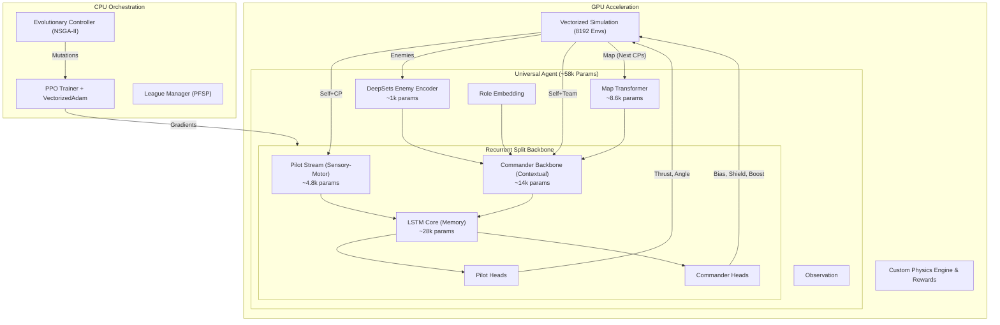

# System Architecture

## Overview
Sebulba's Legacy is designed as a massive-scale reinforcement learning system running purely on the GPU. By bypassing the CPU bottleneck typically found in Python-based RL, we achieve high-throughput training on a single consumer GPU (RTX 5070).

The core philosophy is **"Sim-to-Tensor"**: the simulation state resides on the GPU as a PyTorch tensor, and the policy network inputs and outputs are consumed directly by the physics engine without ever moving memory to the CPU.

## Core Components

### 1. Vectorized Infrastructure
*   **Massive Parallelism**: Trains on **8,192+ concurrent environments** (scalable to 16k on 24GB VRAM).
*   **torch.vmap**: Leveraging PyTorch's `vmap` (Vectorizing Map), we compute forward passes and gradients for the entire population (e.g., 64-128 distinct agents) in a single kernels call. State is batched as `[Population, Batch, Features]`.
*   **Vectorized Adam**: A custom optimizer implementation that updates the parameters of 128 unique neural networks in parallel, supporting per-agent learning rates and independent momentum buffers.

### 2. Universal Actor (The "Recurrent Split Backbone")
To fit complex team strategies and precise driving into a compact model, we use a **Recurrent Split Backbone** architecture. This design processes immediate sensory data and high-level tactical context separately before fusing them in a memory unit.

*   **Pilot Stream (Reactive)**: A lightweight MLP processing immediate physical state (Velocity, Checkpoints). It focuses on the physics of driving.
*   **Commander Stream (Tactical)**: A deeper stream processing context-heavy data (Teammates, Enemies, Role). It utilizes DeepSets for permutation-invariant enemy processing and Role Embeddings.
*   **LSTM Core (Memory)**: Both streams merge into a specialized LSTM. This allows the agent to maintain temporal context (e.g., "I passed the blocker", "I am currently recovering from a collision").
*   **Heads**:
    *   **Pilot Heads**: Thrust, Angle.
    *   **Commander Heads**: Shield, Boost, and Bias adjustments.

### 3. Role Embeddings
Instead of training separate networks for different roles, we inject a learned **Role Embedding** (Size 16) into the Commander Stream.
*   `Role=0`: Blocker Mode
*   `Role=1`: Runner Mode
This allows the single "Universal Brain" to switch its tactical behavior instantly based on its assigned role for the episode, while sharing the fundamental driving skills learned by the Pilot Stream. This replaces the legacy "Mitosis" approach, allowing for specialized behaviors without parameter cloning.

### 4. DeepSets Enemy Encoder
The game can have varying numbers of opponents. We use a **Permutation Invariant** encoder (DeepSets) to process enemy observations.
1.  Each enemy is processed through an MLP to form a latent representation.
2.  Latent vectors are summed (or max-pooled) to create a single fixed-size "Enemy Content Vector".
3.  This vector describes the "threat level" of the race regardless of whether there are 1, 2, or 3 opponents.

### 5. Map Transformer
To provide global track foresight, we employ a compact **Transformer Encoder**:
*   **Input**: A sequence of the next `N` checkpoints (relative to the pod's position and orientation).
*   **Attention**: Uses Self-Attention (math-backend enforced for vmap compatibility) to understand the curvature and complexity of the upcoming path.
*   **Output**: A concise "Map Embedding" that informs the Commander Stream about future turns (e.g., "Sharp right turn coming up").

### 6. Intrinsic Curiosity (RND)
We incorporate **Random Network Distillation** to generate intrinsic rewards.
*   **Target Network**: A fixed, randomly initialized network mapping states to a random output.
*   **Predictor Network**: Tries to predict the Target Network's output.
*   **Reward**: The error (MSE) between the Predictor and Target.
*   **Effect**: The agent gets "bored" of states it has seen often (low error) and seeks novel states (high error), crucial for discovering complex racing lines or blocking strategies.

### 7. Model Complexity
Despite the deep reinforcement learning capability, the model remains highly efficient to ensure high SPS (Steps Per Second).

*   **Total Trainable Parameters**: ~155,449
    *   **Actor Network**: ~57,672 (Lightweight for fast inference)
    *   **Critic Network**: ~97,777 (Larger capacity for accurate value estimation)
*   **Key Component sizes**:
    *   **LSTM Core**: ~28k params
    *   **Map Transformer**: ~8.6k params
    *   **DeepSets Encoders**: ~1k params each

