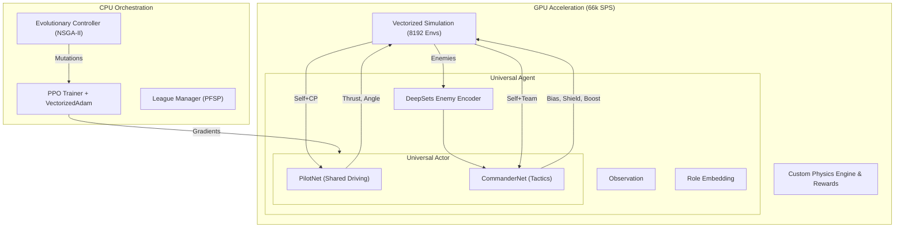

# System Architecture

## Overview
Sebulba's Legacy is designed as a massive-scale reinforcement learning system running purely on the GPU. By bypassing the CPU bottleneck typically found in Python-based RL, we achieve **~66,000 Steps Per Second** on a single consumer GPU (RTX 5070).

The core philosophy is **"Sim-to-Tensor"**: the simulation state resides on the GPU as a PyTorch tensor, and the policy network inputs and outputs are consumed directly by the physics engine without ever moving memory to the CPU.

## Core Components

### 1. Vectorized Infrastructure
*   **Massive Parallelism**: Trains on **8,192+ concurrent environments** (scalable to 16k on 24GB VRAM).
*   **torch.vmap**: Leveraging PyTorch's `vmap` (Vectorizing Map), we compute forward passes and gradients for the entire population (e.g., 64-128 distinct agents) in a single kernels call. State is batched as `[Population, Batch, Features]`.
*   **Vectorized Adam**: A custom optimizer implementation that updates the parameters of 128 unique neural networks in parallel, supporting per-agent learning rates and independent momentum buffers.

### 2. Universal Actor (The "Split Backbone")
To fit the 100k character submission limit while maintaining complex behaviors, we use a **True Parameter Sharing** architecture:

*   **PilotNet (The Driver)**: A shared "backbone" network that handles the physics of driving (Thrust, Steering). Both the Runner and the Blocker use this same network.
*   **CommanderNet (The Tactician)**: A higher-level network that modifies the inputs/outputs of the PilotNet based on the current role.
*   **Role Embeddings**: A learned vector (`Size 16`) injected into the network.
    *   `Role=0`: Blocker Mode
    *   `Role=1`: Runner Mode
    *   This allows the single brain to switch "mindsets" instantly without duplicating weights.

### 3. DeepSets Enemy Encoder
The game can have varying numbers of opponents. We use a **Permutation Invariant** encoder (DeepSets) to process enemy observations.
1.  Each enemy is processed through an MLP to form a latent representation.
2.  Latent vectors are summed (or max-pooled) to create a single fixed-size "Enemy Content Vector".
3.  This vector describes the "threat level" of the race regardless of whether there are 1, 2, or 3 opponents.

### 4. Intrinsic Curiosity (RND)
We incorporate **Random Network Distillation** to generate intrinsic rewards.
*   **Target Network**: A fixed, randomly initialized network mapping states to a random output.
*   **Predictor Network**: Tries to predict the Target Network's output.
*   **Reward**: The error (MSE) between the Predictor and Target.
*   **Effect**: The agent gets "bored" of states it has seen often (low error) and seeks novel states (high error), crucial for discovering complex racing lines or blocking strategies.
