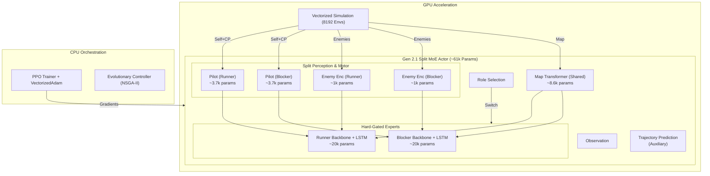

# System Architecture

## Overview
Sebulba's Legacy is designed as a massive-scale reinforcement learning system running purely on the GPU. By bypassing the CPU bottleneck typically found in Python-based RL, we achieve high-throughput training on a single consumer GPU (RTX 5070).

The core philosophy is **"Sim-to-Tensor"**: the simulation state resides on the GPU as a PyTorch tensor, and the policy network inputs and outputs are consumed directly by the physics engine without ever moving memory to the CPU.

## Core Components

### 1. Vectorized Infrastructure
*   **Massive Parallelism**: Trains on **8,192+ concurrent environments** (scalable to 16k on 24GB VRAM).
*   **torch.vmap**: Leveraging PyTorch's `vmap` (Vectorizing Map), we compute forward passes and gradients for the entire population (e.g., 64-128 distinct agents) in a single kernels call. State is batched as `[Population, Batch, Features]`.
*   **Vectorized Adam**: A custom optimizer implementation that updates the parameters of 128 unique neural networks in parallel, supporting per-agent learning rates and independent momentum buffers.

### 2. Universal Actor (The "Recurrent Split Backbone")
Instead of a monolithic network, we use a **Hard-Gated Mixture of Experts (MoE)** architecture. This allows the model to switch between entirely different behavioral "brains" depending on its assigned role.

*   **DeepSets Enemy Encoder (Split)**: We naturally split the enemy encoder.
    *   `enemy_embedder_runner`: Learning to perceive enemies as obstacles to avoid.
    *   `enemy_embedder_blocker`: Learning to perceive enemies as targets to intercept.
*   **Pilot Stream (Split)**: We also split the Pilot Stream (Motor Control).
    *   `pilot_embed_runner`: Optimizes for pure speed and racing lines.
    *   `pilot_embed_blocker`: Optimizes for stability and impact resilience.
*   **Mixture of Experts (MoE)**:
    *   **Runner Expert**: A specialized backbone and LSTM optimized for high-speed racing.
    *   **Blocker Expert**: A specialized backbone and LSTM optimized for physics combat.
*   **Trajectory Prediction (Auxiliary)**: A prediction head that attempts to forecast the next position of the nearest enemy. It is driven by the shared "Enemy Context" but gradients flow to the specific encoder in use.
*   **Selection Head**: Gating logic that activates the corresponding expert based on the `role_id`. During inference, both streams run, but only one is selected.

### 3. Role Embeddings & Contextual Condition
Instead of separate networks, we use a **Context-Conditioned** approach. A learned **Role Embedding** (Size 16) is concatenated with the core observations before entering the Commander Backbone.
*   `Role=0`: **Blocker Mode**. Activates weights and behavioral patterns focused on intercepting and colliding with opponents.
*   `Role=1`: **Runner Mode**. Activates patterns focused on optimal racing lines and speed.

This design allows the "Universal Brain" to share driving fundamentals (via the Pilot Stream) while specializing tactical behavior (via the Commander Stream). Gradients flow back to the specific embedding for the active role, ensuring that "Blocker" successes only optimize the Blocker context.

### 4. DeepSets Enemy Encoder
The game can have varying numbers of opponents. We use a **Permutation Invariant** encoder (DeepSets) to process enemy observations.
1.  Each enemy is processed through an MLP to form a latent representation.
2.  Latent vectors are summed (or max-pooled) to create a single fixed-size "Enemy Content Vector".
3.  This vector describes the "threat level" of the race regardless of whether there are 1, 2, or 3 opponents.

### 5. Map Transformer
To provide global track foresight, we employ a compact **Transformer Encoder**:
*   **Input**: A sequence of the next `N` checkpoints (relative to the pod's position and orientation).
*   **Attention**: Uses Self-Attention (math-backend enforced for vmap compatibility) to understand the curvature and complexity of the upcoming path.
*   **Output**: A concise "Map Embedding" that informs the Commander Stream about future turns (e.g., "Sharp right turn coming up").

### 6. Intrinsic Curiosity (RND)
We incorporate **Random Network Distillation** to generate intrinsic rewards.
*   **Target Network**: A fixed, randomly initialized network mapping states to a random output.
*   **Predictor Network**: Tries to predict the Target Network's output.
*   **Reward**: The error (MSE) between the Predictor and Target.
*   **Effect**: The agent gets "bored" of states it has seen often (low error) and seeks novel states (high error), crucial for discovering complex racing lines or blocking strategies.

### 7. Model Complexity
Despite the deep reinforcement learning capability, the model remains highly efficient to ensure high SPS (Steps Per Second).

*   **Total Trainable Parameters**: ~145,000
    *   **Actor Network**: ~60,900 (Inference model)
        *   **MoE Experts**: ~20k params each (Backbone + LSTM)
        *   **Map Transformer**: ~8.6k params
        *   **Pilot Stream**: ~3.7k params x 2 (Split)
        *   **DeepSets Encoders**: ~1k params x 2 (Split)
    *   **Critic Network**: ~84,321 (Accurate value estimation)

