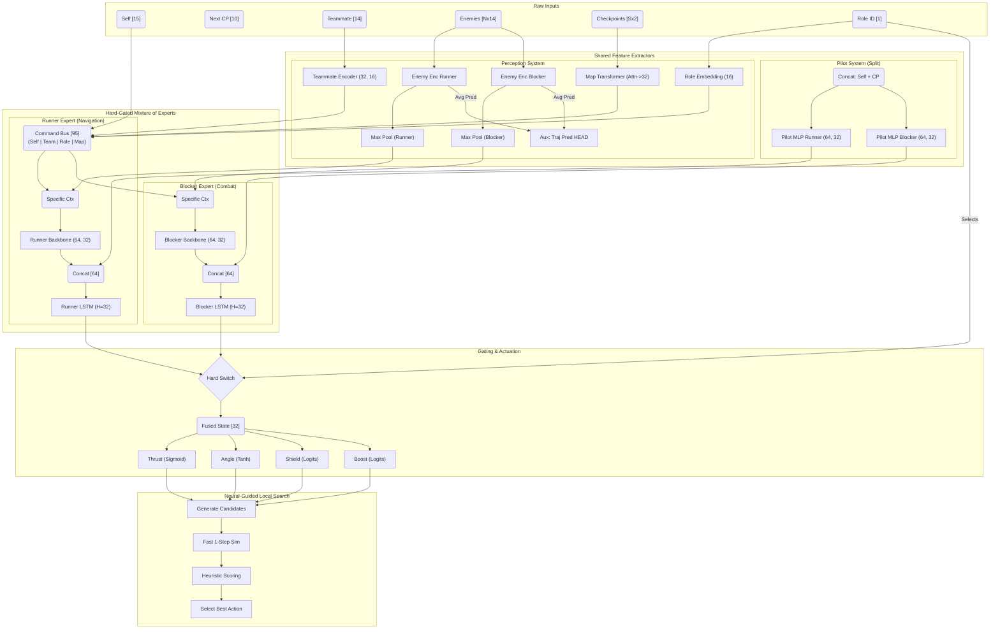

# Submission Architecture

The `submission.py` file is a standalone, single-file solution designed to run within the strict constraints of the coding challenge (100K characters size limit, 1000ms response time, no external libraries like PyTorch/NumPy).

## Overview

The submission logic is generated by `export.py`, which performs the following transformation pipeline:
Our solution, **Sebulba's Legacy**, employs a high-throughput, GPU-bound reinforcement learning architecture. The core model is a **Hard-Gated Mixture of Experts (MoE)** that specializes in both high-speed navigation and tactical interception.

### Key Architectural Pillars:
1.  **MoE Recurrent Backbone**: Separate specialized backbones and LSTMs for "Runner" and "Blocker" roles, allowing the model to master distinct physics of racing and combat.
2.  **Trajectory Prediction**: An auxiliary prediction head that forecasts enemy movement, forcing the feature encoders to internalize opponent physics.
3.  **Map Transformer**: A compact self-attention module that provides long-range track foresight.
4.  **DeepSets Context**: A permutation-invariant encoder for handling multiple enemies.
5.  **Base85 Serialization**: A custom weight packing scheme that fits the ~56k parameter actor into the competition's character limit.
5.  **Template Injection**: Injects the encoded blob and a minified physics engine into a predefined `SINGLE_FILE_TEMPLATE` (the "Micro-Inference Engine").

## The Micro-Inference Engine (`class N`)

The heart of the submission is the `N` class, a minimal neural network framework implemented in pure Python/Math.

### Components
-   **`dc(b, s)`**: **Decoder**. Decodes the Base85 blob back into a list of weights and applies the quantization scale factor to restore approximate float values.
-   **`gw(n)`**: **Get Weights**. A cursor-based weight reader. It strictly consumes `n` weights from the loaded list and advances the cursor. This requires the inference logic (`f`) to call layers in the *exact* order they were exported.
-   **`l(x, i, o)`**: **Linear Layer**. Performs matrix-vector multiplication $y = Wx + b$.
    -   `i`: Input dimension.
    -   `o`: Output dimension.
    -   Supports strictly ReLU activation (via `r=True` argument) or raw output.
    -   Uses pre-fused bias (part of `w`).
-   **`ls(x)`**: **LSTM Cell**. A manual implementation of a Long Short-Term Memory cell.
    -   Manages hidden states `self.h` and `self.C`.
    -   Performs the gate computations (Input, Forget, Cell, Output).
-   **`mr(m)`**: **Map Reduce (Transformer)**. A functional implementation of the Map Transformer.
    -   Manually implements the Multi-Head Attention, Layer Norm, and Feed-Forward Network operations using raw list comprehensions and math functions.
    -   Processes the sequence of checkpoint observations.
-   **`f(...)`**: **Forward Pass**. Reconstructs the `PodAgent` static graph.
    1.  **Pilot Embed**: Processes `s` (Self) + `cp` (Checkpoints) through TWO paths (Runner/Blocker).
    2.  **Entity Encoding**: Processes `tm` (Team) and `en` (Enemy) via separate `enemy_enc` weights for Runner/Blocker context.
    3.  **Context Aggregation**: Performs max pooling on entity embeddings for both contexts.
    4.  **Role & Map**: Lookups role embedding (`re`) and runs Map Transformer (`mr`).
    5.  **Gated Execution**: Selects the active branch (`if rv==0: run else: block`).
    6.  **Commander Backbone**: Passes specific context through specific MLP.
    7.  **LSTM**: Updates specific memory state (Runner or Blocker).
    8.  **Heads**: Computes final action logits.

### Inference Data Flow

### Inference Data Flow

## Model Complexity

The submission model is a direct export of the trained `PodAgent` (Actor), highly optimized for size and speed.

| Metric | Value |
| :--- | :--- |
| **Total Parameters (Actor)** | **~60,900** |
| **Total Parameters (Critic)** | **~84,321** |
| **Model Size (Uncompressed)** | ~600 KB (FP32) |
| **Final Export Size** | **~97,454 chars** (Base85) |
| **Inference Latency** | < 1ms (on typical hardware) |

## Neural-Guided Local Search

The submission does not rely solely on the policy output. It uses the policy to "bootstrap" a local search:

1.  **Policy Proposal**: The model predicts:
    -   `r_th`: Target thrust (0-100).
    -   `r_ang`: Target turn angle relative to current heading.
    -   `r_sh`/`r_bo`: Shield/Boost probabilities.
2.  **Candidate Generation**: The system generates a set of candidate actions:
    -   The exact policy prediction.
    -   Variations of the policy angle (e.g., $\pm 3^\circ, \pm 6^\circ, \pm 12^\circ$).
    -   High-thrust (100) or Zero-thrust (0) alternatives.
3.  **Fast Physics Simulation (`sim`)**:
    -   Using `FAST_PHYSICS_CODE` (a minified version of the game physics), the system simulates the outcome of each candidate action for **1 step**.
4.  **Scoring (`sc`)**:
    -   Evaluates the simulated state based on distance to next checkpoint, alignment with future checkpoints, and collision risks.
    -   Selects the action with the highest score.

This hybrid approach allows the agent to correct small pointing errors by the neural network and avoid obvious immediate collisions, effectively combining the intuition of RL with the precision of classic search.
