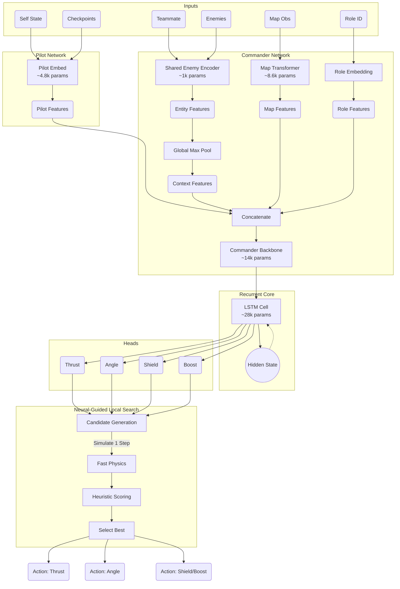

# Submission Architecture

The `submission.py` file is a standalone, single-file solution designed to run within the strict constraints of the coding challenge (100K characters size limit, 1000ms response time, no external libraries like PyTorch/NumPy).

## Overview

The submission logic is generated by `export.py`, which performs the following transformation pipeline:
1.  **Model Loading**: Loads the trained PyTorch `PodAgent` (from `training/ppo.py`).
2.  **Normalization Fusion**: Fuses Running Mean/Std statistics and Batch Normalization layers directly into the weights of adjacent Linear layers (e.g., Pilot Normalization, Commander Normalization). This removes the need for normalization logic at runtime.
3.  **Weight Quantization**: Converts all weights to `int8` (hashed to [-127, 127]) and calculates a global scale factor.
4.  **Base85 Encoding**: Encodes the byte stream of quantized weights using a custom Base85-like encoding (using ASCII offset 33) to maximize information density (1.25 characters per byte).
5.  **Template Injection**: Injects the encoded blob and a minified physics engine into a predefined `SINGLE_FILE_TEMPLATE` (the "Micro-Inference Engine").

## The Micro-Inference Engine (`class N`)

The heart of the submission is the `N` class, a minimal neural network framework implemented in pure Python/Math.

### Components
-   **`dc(b, s)`**: **Decoder**. Decodes the Base85 blob back into a list of weights and applies the quantization scale factor to restore approximate float values.
-   **`gw(n)`**: **Get Weights**. A cursor-based weight reader. It strictly consumes `n` weights from the loaded list and advances the cursor. This requires the inference logic (`f`) to call layers in the *exact* order they were exported.
-   **`l(x, i, o)`**: **Linear Layer**. Performs matrix-vector multiplication $y = Wx + b$.
    -   `i`: Input dimension.
    -   `o`: Output dimension.
    -   Supports strictly ReLU activation (via `r=True` argument) or raw output.
    -   Uses pre-fused bias (part of `w`).
-   **`ls(x)`**: **LSTM Cell**. A manual implementation of a Long Short-Term Memory cell.
    -   Manages hidden states `self.h` and `self.C`.
    -   Performs the gate computations (Input, Forget, Cell, Output).
-   **`mr(m)`**: **Map Reduce (Transformer)**. A functional implementation of the Map Transformer.
    -   Manually implements the Multi-Head Attention, Layer Norm, and Feed-Forward Network operations using raw list comprehensions and math functions.
    -   Processes the sequence of checkpoint observations.
-   **`f(...)`**: **Forward Pass**. Reconstructs the `PodAgent` static graph.
    1.  **Pilot Embed**: Processes `s` (Self) + `cp` (Checkpoints).
    2.  **Entity Encoding**: Processes `tm` (Team) and `en` (Enemy) via shared `ec` (Enemy Encoder) weights.
    3.  **Context Aggregation**: Performs global max pooling on entity embeddings.
    4.  **Role & Map**: Lookups role embedding (`re`) and runs Map Transformer (`mr`).
    5.  **Commander Backbone**: Concatenates all features and passes through MLP.
    6.  **LSTM**: Updates memory state.
    7.  **Heads**: Computes final action logits (Thrust, Angle, Shield, Boost).

### Inference Data Flow

## Model Complexity

The submission model is a direct export of the trained `PodAgent` (Actor), highly optimized for size and speed.

*   **Total Parameters**: ~58k (Actor only)
*   **Key Component Breakdown**:
    *   **LSTM Core**: ~28k params (Maintains temporal context)
    *   **Commander Backbone**: ~14k params (Tactical decision making)
    *   **Map Transformer**: ~8.6k params (Track analysis)
    *   **Pilot Stream**: ~4.8k params (Basic driving skills)
    *   **Enemy/Team Encoders**: ~1k params each (Entity processing)

## Neural-Guided Local Search

The submission does not rely solely on the policy output. It uses the policy to "bootstrap" a local search:

1.  **Policy Proposal**: The model predicts:
    -   `r_th`: Target thrust (0-100).
    -   `r_ang`: Target turn angle relative to current heading.
    -   `r_sh`/`r_bo`: Shield/Boost probabilities.
2.  **Candidate Generation**: The system generates a set of candidate actions:
    -   The exact policy prediction.
    -   Variations of the policy angle (e.g., $\pm 3^\circ, \pm 6^\circ, \pm 12^\circ$).
    -   High-thrust (100) or Zero-thrust (0) alternatives.
3.  **Fast Physics Simulation (`sim`)**:
    -   Using `FAST_PHYSICS_CODE` (a minified version of the game physics), the system simulates the outcome of each candidate action for **1 step**.
4.  **Scoring (`sc`)**:
    -   Evaluates the simulated state based on distance to next checkpoint, alignment with future checkpoints, and collision risks.
    -   Selects the action with the highest score.

This hybrid approach allows the agent to correct small pointing errors by the neural network and avoid obvious immediate collisions, effectively combining the intuition of RL with the precision of classic search.
